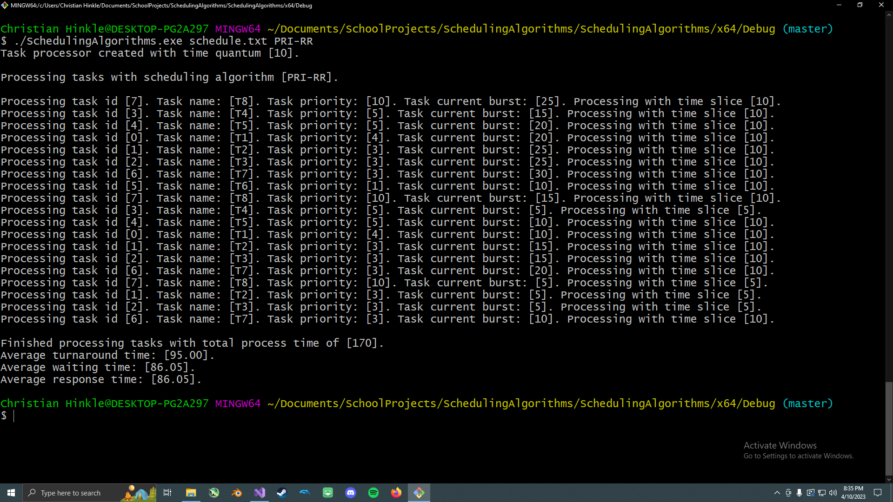
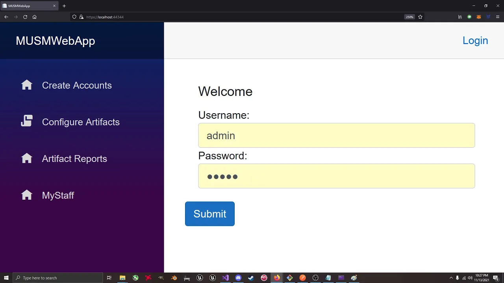
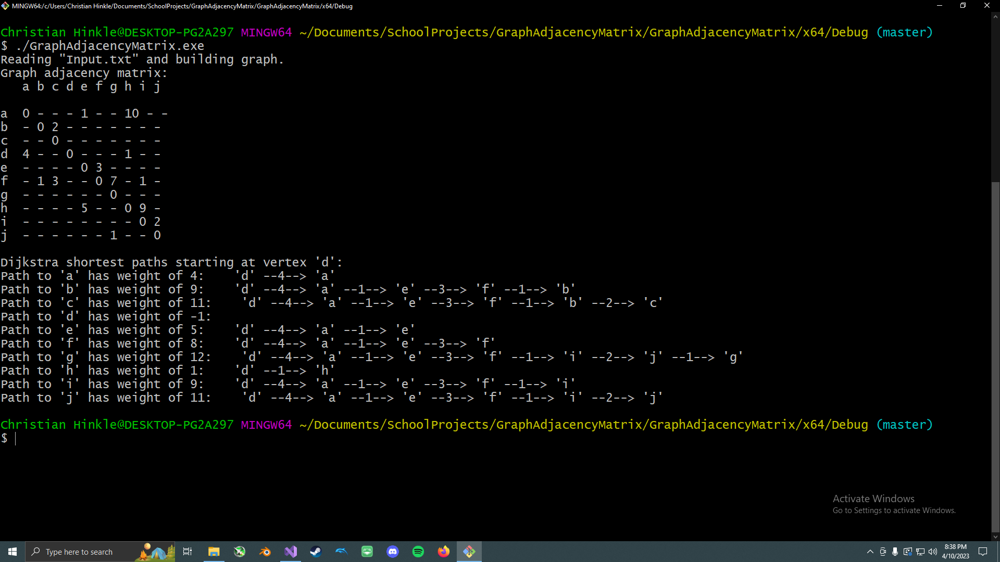
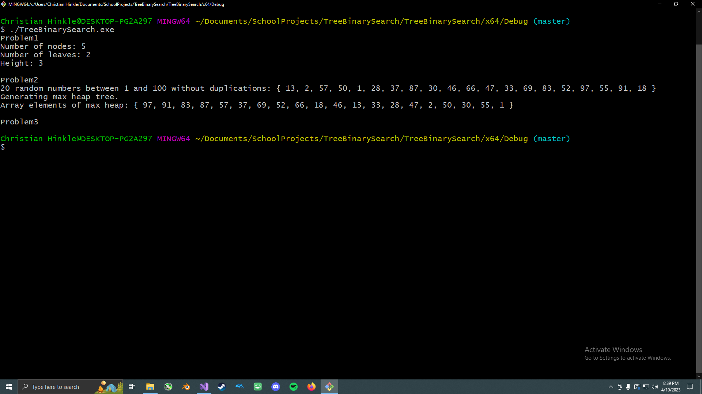

Portfolio
=========

Programming Projects
--------------------

*For access to my private project repositories, please [email me](mailto:cthinkle9@csustudent.net?subject=GitHub%20Access) with the subject line, GitHub Access.

---
### [Scheduling Algorithms | CSCI 431](Project_SchedulingAlgorithms)

---
### [Medical University Student Management | CSCI 495](Project_MedicalUniversityStudentManagement)

---
### [Graph Adjacency Matrix | CSCI 415](Project_GraphAdjacencyMatrix)

---
### [Tree Binary Search | CSCI 415](Project_TreeBinarySearch)

---

Ethics Papers
-------------

### [Ethical Programming](/pdf/EthicsPapers/EthicsPaper_SurveyOfScriptingLanguages.pdf)

- **Class:** Survey of Scripting Languages (CSCI 301)
- **Grade:** A

### [Decisive Ethics](/pdf/EthicsPapers/EthicsPaper_DataStructuresAnalysis.pdf)

- **Class:** Data Structures Analysis (CSCI 315)
- **Grade:** A

### [The Good Hacker](/pdf/EthicsPapers/EthicsPaper_ProceduralProgramming.pdf)

- **Class:** Procedural Programming (CSCI 235)
- **Grade:** A

---

Presentations
-------------

### [Crypto Wallet Hardening](/pdf/Presentations/Crypto%20Wallet%20Hardening.pptx.pdf)

- **Class:** Cyber Defense (CSCI 352)
- **Grade:** A

### [Nord VPN Breach](/pdf/Presentations/Nord%20VPN%20Breach.pdf)

- **Class:** Survery of Scripting Languages (CSCI 301)
- **Grade:** A

---

Page template forked from <a href="https://github.com/csu-cs/csci-portfolio">CSU-CS</a>

<!-- Remove above link if you don't want to attributive -->
